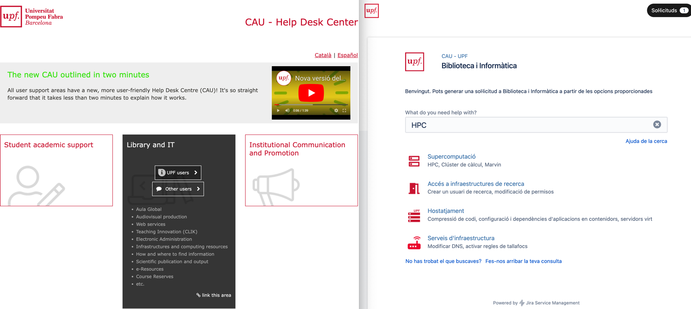
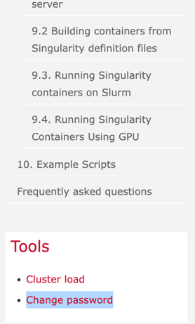
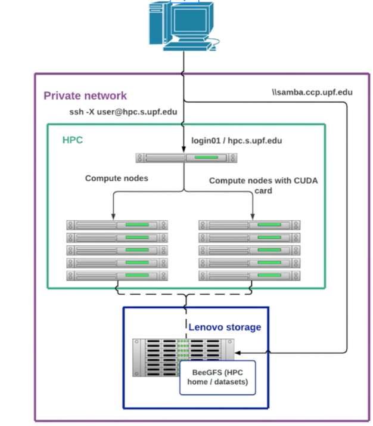
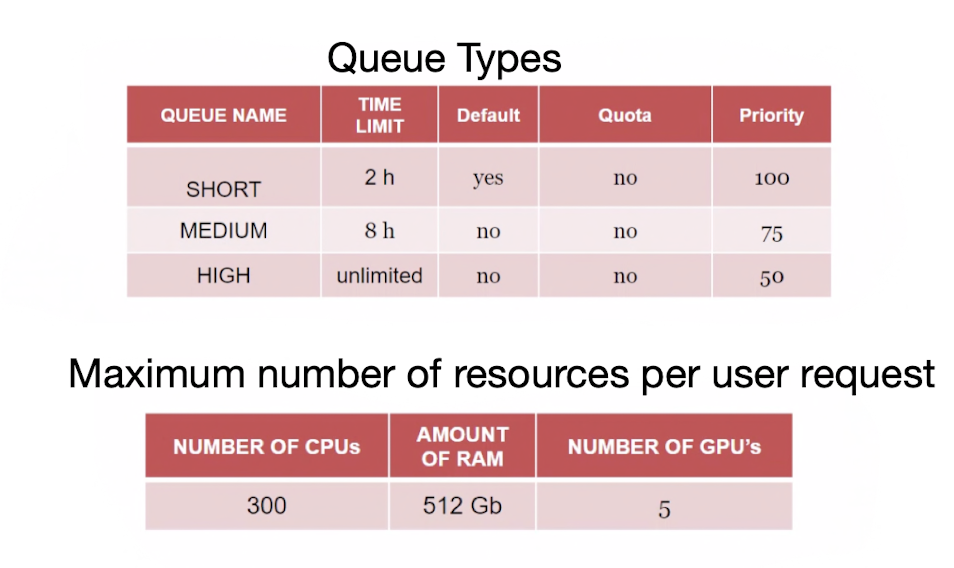
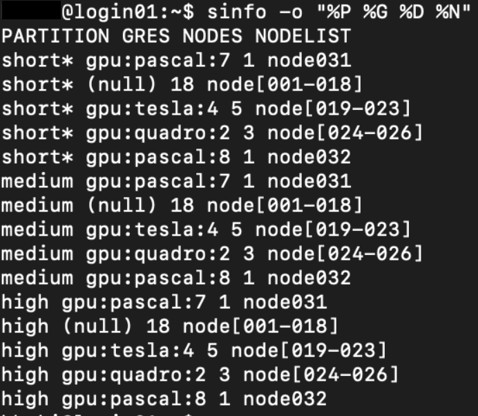

# A Guide to the HPC Clusters

# Table of Contents
1. [Getting Started](#1)
   1. [Accounts](#1.1)
   2. [Accessing the Clusters](#1.2)
2. [Using the Clusters](#2)
    1. [Resources](#2.1)
    2. [Interactive Sessions](#2.2)
    3. [Submitting Jobs](#2.3)
    4. [Available Software](#2.4)
    5. [Monitoring or Cancelling Jobs](#2.5)


This guide is intended to help you get started with the HPC clusters. It is not intended to be a comprehensive guide, 
but rather a quick reference to get you started. For the cluster documentation, please refer to [here](https://guiesbibtic.upf.edu/recerca/hpc).) 

> **Note:** If you have any questions, please contact the cluster administrators by
> making a [CAU ticket](https://cau.upf.edu/) for `Library and IT / Supercomputació`.



## 1. Getting Started <a name="1"></a>
### 1.1. Accounts <a name="1.1"></a>

To access the HPC clusters, you need to have a **RESEARCH ID**. This ID is **different** from your UPF account (uXXXXXXX).
By default, Master's and PhD students at the UPF have  access to the HPC clusters. 
Alternatively, you should contact your supervisor to get access to the clusters.

> **Note:** The  **RESEARCH IDs** are commonly formatted as **`[first character of first name][last name]`** (e.g. `jdoe` for John Doe). 
> You need a password set up to access the clusters using your ID. You can set up your password by providing you username
> using this [link](https://login.rp.upf.edu/?action=sendtoken) (to change password, use this [link](https://login.rp.upf.edu/)).
> If these links are inactive, navigate to `Tools > Change Password` on the [guide](https://guiesbibtic.upf.edu/recerca/hpc)
> 
> 

### 1.2. Accessing the Clusters <a name="1.2"></a>

To access the cluster you need to first be connected to the `UPF VPN` network. You can find instructions on how to
connect to the VPN using `Forticlient` 
(instructions [here](https://www.upf.edu/en/web/biblioteca-informatica/serveis-pdi/-/asset_publisher/g2SvxJwKuVBy/content/id/114979410/maximized).)

> **Note:** Remember that to access the **VPN** you should connect to the UPF network using your **UPF account** (**uXXXXXXX**).
> However, for connecting to the cluster, you should use your **RESEARCH ID**. These two accounts are different and 
> don't share the same password necessarily.

To connect to the cluster, you can use the following command in your terminal:

```bash
ssh -X [RESEARCH_ID]@hpc.s.upf.edu

Example: ssh -X jdoe@hpc.s.upf.edu
```

In order to access your files on the cluster, you can use a `File Transfer Protocol (FTP)` client such as 
[**FileZilla**](https://filezilla-project.org/). If you decide to use **FileZilla**, to connect to the cluster, 
go to `File > Site Manager` and add a new site. Then, place your **RESEARCH ID** and password in the `Login Type`, 
while setting the remaining settings as follows:


## 2. Using the Clusters <a name="2"></a>

### 2.1. Resources <a name="2.1"></a>
The HPC clusters are composed of two sets of nodes: `Login` and `Compute`. When you first ssh into the cluster,
you will be connected to a `Login` node. The `Login` nodes are used to submit jobs to the `Compute` nodes or request
interactive access to the `Compute` nodes. The compute nodes are used to run the jobs submitted by the users. 

> **Warning:** The `Login` nodes are not meant to run jobs. You **SHOULD NOT** do any computation on the `Login` nodes.



To run a job on the cluster, your submitted task or your request for interactive access will be placed in a queue.
As soon as a `Compute` node is available, your job will be executed. The place in the queue is determined by the
`priority` of the job as well as the amount of resources requested by the user for the task as well as the amount of
resources previously used by the user. As a result, to ensure that you minimize the time you wait in the queue, you
should request the minimum amount of resources necessary to run your job. **This will also ensure that you will not
lower your priority in the queue for future jobs.**

###### PRIORITY LEVELS

There are different `priority` levels for the jobs. The priority levels are as follows:




###### GPU RESOURCES AVAILABLE <a name="gpus_avail"></a>

There are a variety of GPU resources available on the cluster. The GPUs are available on the `Compute` nodes.
At the time of writing this guide, the GPUs available on the cluster are listed in the following table:

| GPU  Model      | Architecture | VRAM  | CUDA CORES | --gres Tag          |
|-----------------|--------------|-------| --- |---------------------|
| Quadro RTX 6000 | Turing       | 24 GB | 4608 | --gres=gpu:quadro:1 |
| Tesla T4        | Turing       | 16 GB | 2560  | --gres=gpu:tesla:1  |    
| GTX 1080 Ti     | Pascal       | 11 GB | 3584  | --gres=gpu:pascal:1 |

To get the list of available GPUs on the cluster, you can use the following command:

```bash
sinfo -o "%P %G %D %N"
```




### 2.2. Interactive Sessions <a name="2.2"></a>

To start an interactive session, you can use the following commands:

For **CPU-ONLY** tasks:

```bash
 srun --nodes=1 --partition=short --cpus-per-task=4 --mem=8g --pty bash -i
```

For **CPU/GPU** tasks:

```bash
srun --nodes=1 --partition=short --gres=gpu:1 --cpus-per-task=4 --mem=8g --pty bash -i
```

The `--gres` flag is used to request the GPU resources. If any GPU works for your task, you can use `--gres=gpu:X` where
`X` is the number of GPUs you want to request. If you want to request a **specific GPU**, you can use `--gres=gpu:[GPU_MODEL]:X`
where `[GPU_TAG]` is the model of the GPU you want to request and `X` is the number of GPUs you want to request. For
the list of available GPU flags, refer to the last column of the table presented above in the 
section called [GPU RESOURCES AVAILABLE](#gpus_avail).

To learn more about interactive sessions, refer to the 
[**HPC Documentation**](https://guiesbibtic.upf.edu/recerca/hpc/interactive-jobs).


### 2.3. Submitting Jobs <a name="2.3"></a>

To submit a job, you need to create a `job script` that contains the commands you want to run. The job script
should be saved in a file with the `.sh` extension. An example of a job script is shown below:

```bash
#!/bin/bash
#SBATCH -J sweep_small
#SBATCH -p medium
#SBATCH -N 1
#SBATCH --gres=gpu:tesla:1
#SBATCH --cpus-per-task=4
#SBATCH --mem=16g
#SBATCH --time=8:00
#SBATCH -o %N.%J.OUTPUT.out
#SBATCH -e %N.%J.ERROR_LOGS.err

source /etc/profile.d/lmod.sh
source /etc/profile.d/zz_hpcnow-arch.sh

module load Anaconda3/2020.02

source activate GrooveTransformer
python run_some_code.py
```

For more information about the job script, refer to the 
[**Basic Jobs**](https://guiesbibtic.upf.edu/recerca/hpc/basic-jobs) section of the HPC documentation.

### 2.4 Available Software <a name="2.4"></a>
Many packages and applications are pre-compiled for use on the cluster. 

These packages can be viewed [here](https://hpc.rp.upf.edu/lmod-web/).

Alternatively, in an interactive session, you can call the `module avail` command after sourcing the 
`/etc/profile.d/lmod.sh` and `/etc/profile.d/zz_hpcnow-arch.sh` files.

```shell
source /etc/profile.d/lmod.sh
source /etc/profile.d/zz_hpcnow-arch.sh
module avail
```
If you want to search for a specific package, use the `module spider PACKAGE_NAME` command:

```shell
module spider conda
```

Once you find a module, you can simply include it in your session by calling the `module load PACKAGE_NAME` command:

```shell
module load Anaconda3/2020.02
```

If you need a package that is not available, you can install it via conda, or pip (if Anaconda and/or Python) modules
are loaded. Alternatively, contact the cluster admins (see beginning of this guide), and ask them to install the 
software as a module to be loaded directly in a project.

### 2.5. Monitoring or Canceling Jobs <a name="2.5"></a>

Use the `squeue` command to monitor the jobs you have submitted. The `squeue` command will show you the jobs
that are currently running, the jobs that are waiting in the queue, and the jobs that have finished running.

```bash
squeue 
```

If you have specified the output and error logs in your job script using the `#SBATCH -o` and `#SBATCH -e` flags,
you can use the `vim` command to view the output and error logs of your job. Example:

```bash
vim node018.221673.OUTPUT.out
vim node018.221673.OUTPUT.err
```

To cancel a job, get the `job-id` from the queue list obtained using `squeue`. Then, use the  `scancel` command 
with the `job-id` as the argument. Example:

```bash 
scancel 1234567
```
