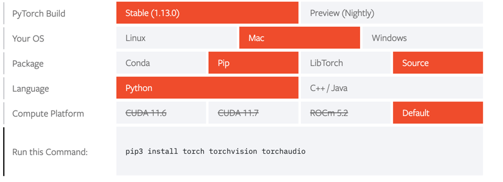

# Environment Setup 
# Table of Contents
1. [Required Packages](#1)
2. [CPU Installation](#2)
   1. [venv Installation](#2.1)
   2. [Anaconda Installation](#2.2)
3. [GPU Installation](#3)
   1. [Local GPU Installation](#3.1)
   2. [HPC Cluster GPU Installation](#3.2)
      1. [Anaconda Installation](#3.2.1)


# 1. Required Packages <a name="1"></a>
The repository was last tested with 
the following versions of the [packages](../../demos/installation/requirements_gpu.txt):

```commandline
pytorch==1.12.1 
torchvision==0.13.1 
torchaudio==0.12.1 
cudatoolkit=10.2    ----> GPU ONLY!
bokeh==2.4.3
colorcet==3.0.0
fluidsynth==0.2
holoviews==1.15.1
librosa==0.9.2
matplotlib==3.6.0
note_seq==0.0.5
numpy==1.23.3
pandas==1.5.0
pretty_midi==0.2.9
pyFluidSynth==1.3.1
PyYAML==6.0
scikit_learn==1.1.3
scipy==1.9.1
soundfile==0.11.0
tqdm==4.64.1
wandb==0.13.3
```

> **Note:** In order to be able to use pyFluidSynth, you need to install fluidsynth software
> on your machine. pyFluidSynth needs fluidsynth to be installed on your machine in order to
> work. You can install fluidsynth using the following command:
> On Mac, you can do this by running 
> ```commandline
> brew install fluidsynth
> ```
> Alternatively, on Mac and Linux, you can install fluidsynth using the following command:
> ```commandline
> conda install -c conda-forge fluidsynth
> ```
> In this repo, the fluidsynth package is used to generate audio from a number of different symbolic
> representations such as `MIDI`, `Note_Sequence`, and `HVO_Sequence`. 

> **Warning:** If you decide to install fluidsynth using the conda-forge channel, we recommend that you 
> prepare your conda environment first using the guides in section [2.2](#2.2) or [3.1](#2.3)

### 2. CPU Installation  <a name="2"></a>
#### 2.1  venv Installation <a name="2.1"></a>
First create a virtual environment:
```commandline
python3 -m venv GrooveTransformerVenv
```
Then activate the virtual environment and install the required packages:
```commandline
source GrooveTransformerVenv/bin/activate
```
To install torch, navigate to the [pytorch website](https://pytorch.org/get-started/locally/) 
and select the appropriate installation command for your system. See figure below for an example:



Then while the virtual environment is activated, run the following command to install the required packages:

```commandline
pip install bokeh==2.4.3
pip install colorcet==3.0.0
pip install fluidsynth==0.2
pip install holoviews==1.15.1
pip install librosa==0.9.2
pip install matplotlib==3.6.0
pip install note_seq==0.0.5
pip install numpy==1.23.3
pip install pandas==1.5.0
pip install pretty_midi==0.2.9
pip install pyFluidSynth==1.3.1
pip install PyYAML==6.0
pip install scikit_learn==1.1.3
pip install scipy==1.9.1
pip install soundfile==0.11.0
pip install tqdm==4.64.1
pip install wandb==0.13.3
```

#### 2.2 [`Anaconda`](https://www.anaconda.com/) Installation <a name="2.2"></a>
To install the packages using conda, run the following command:

```commandline
conda create --name GrooveTransformer python=3.9
source activate GrooveTransformer

conda install pytorch==1.12.1 torchvision==0.13.1 torchaudio==0.12.1  -c pytorch
pip install bokeh==2.4.3
pip install colorcet==3.0.0
pip install fluidsynth==0.2
pip install holoviews==1.15.1
pip install librosa==0.9.2
pip install matplotlib==3.6.0
pip install note_seq==0.0.5
pip install numpy==1.23.3
pip install pandas==1.5.0
pip install pretty_midi==0.2.9
pip install pyFluidSynth==1.3.1
pip install PyYAML==6.0
pip install scikit_learn==1.1.3
pip install scipy==1.9.1
pip install soundfile==0.11.0
pip install tqdm==4.64.1
pip install wandb==0.13.3
```

### 3. GPU Installation <a name="3"></a>

#### 3.1 GPU Installation on Local Machines <a name="3.1"></a>
The gpu installation is similar to the cpu installation, except that you need to install the
`cudatoolkit` package.

If you are using `conda`, you can install the `cudatoolkit` package using the following command:

```commandline
conda install pytorch==1.12.1 torchvision==0.13.1 torchaudio==0.12.1 cudatoolkit=10.2 -c pytorch
```

If you are using `pip`, you can install the `cudatoolkit` package using the pytorch suggested command 
found [here](https://pytorch.org/get-started/locally/).

#### 3.2 Installation on HPC Clusters <a name="3.2"></a>

The installations here are specific to the [`UPF DTIC HPC`](https://guiesbibtic.upf.edu/recerca/hpc) clusters. 
If you haven't used the clusters before, you can find a guide on how to use them [here](HPC_Cluster_Guide.md).

###### 3.2.1 Anaconda

>  **Warning:** You can prepare the environment using `Anaconda`. This can be done either using an 
> [interactive session](https://guiesbibtic.upf.edu/recerca/hpc/interactive-jobs), or by submitting a 
> [remote job](https://guiesbibtic.upf.edu/recerca/hpc/basic-jobs) using `sbatch` command. 
> That said, the installation may take a long time, as a result, we highly suggest preparing the environment 
> remotely

A template shell file is available in [demos/installation/env_setup_conda_gpu.sh](../../demos/installation/env_setup_conda_gpu.sh).
The content of this file is as follows:

```shell
#!/bin/bash
#SBATCH -J env_setup
#SBATCH -p medium
#SBATCH -N 1
#SBATCH --cpus-per-task=4
#SBATCH --mem=8g
#SBATCH -o %N.%J.env_setup_conda.out
#SBATCH -e %N.%J.env_setup_conda.err

source /etc/profile.d/lmod.sh
source /etc/profile.d/zz_hpcnow-arch.sh

module load Anaconda3/2020.02

# Create a new conda environment with Python 3.9 if it doesn't exist
# UNCOMMENT THE FOLLOWING LINE IF YOU WANT TO CREATE A THE ENVIRONMENT for THE FIRST TIME
# conda create --name GrooveTransformer python=3.9

conda activate GrooveTransformer

conda install pytorch==1.12.1 torchvision==0.13.1 torchaudio==0.12.1 cudatoolkit=10.2 -c pytorch
pip install bokeh==2.4.3
pip install colorcet==3.0.0
pip install fluidsynth==0.2
pip install holoviews==1.15.1
pip install librosa==0.9.2
pip install matplotlib==3.6.0
pip install note_seq==0.0.5
pip install numpy==1.23.3
pip install pandas==1.5.0
pip install pretty_midi==0.2.9
pip install pyFluidSynth==1.3.1
pip install PyYAML==6.0
pip install scikit_learn==1.1.3
pip install scipy==1.9.1
pip install soundfile==0.11.0
pip install tqdm==4.64.1
pip install wandb==0.13.3
```

> **Note:** If you don't have previously created a conda environment, you need to uncomment the 
> `conda create --name GrooveTransformer python=3.9` line, or simply create the environment using the following
> set of commands in an interactive session prior to submitting the above shell file remotely
> ```shell
> # Get access to a cpu-only node on the short partition
> srun --nodes=1 --partition=short --cpus-per-task=4 --mem=8g --pty bash -i
> 
> # Get access to existing modules available on the cluster  
> source /etc/profile.d/lmod.sh
> source /etc/profile.d/zz_hpcnow-arch.sh
> 
> # Load Anaconda
> module load Anaconda3/2020.02
> 
> # Create GrooveTransformer Conda Environment
> conda create --name GrooveTransformer python=3.9
>
> ```

> **Warning:** It is possible that the Anaconda3/2020.02 module is updated and this version is no longer
> available. In such case, run `module avail` or  `module spider Anaconda` to see which versions are available.
> 
> **Note:** Make sure you have sourced `/etc/profile.d/lmod.sh` and  `/etc/profile.d/zz_hpcnow-arch.sh` to be able 
> to use the `module` command. 