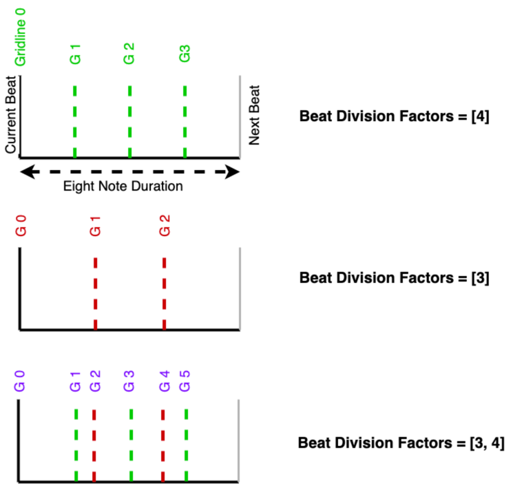
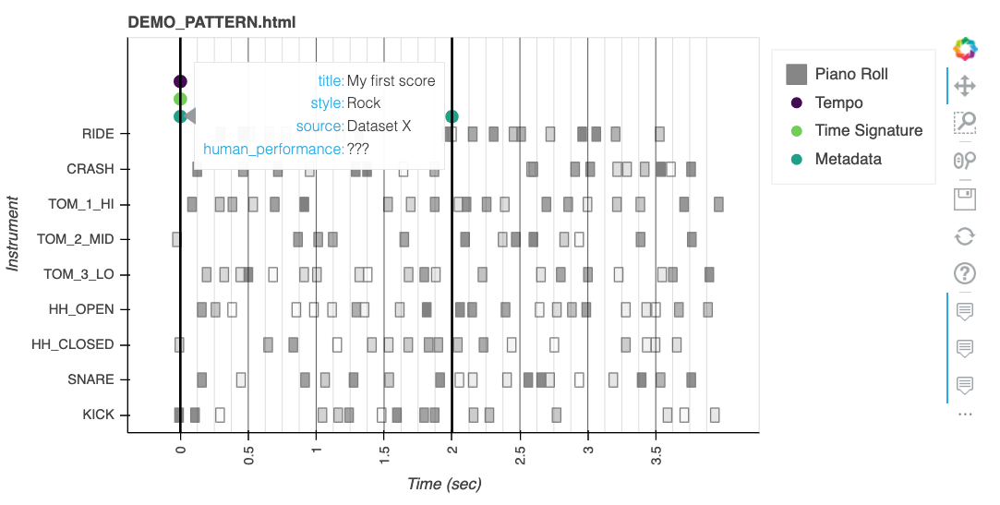

## Chapter 1B - HVO Sequence: A Grid-relative Piano Roll Representation for Drum Sequences  
 


# Table of Contents
1. [Basic Attributes](#1)
   1. [Beat Division Factors](#1.1)
   2. [Drum Mapping](#1.2)
   3. [Grid Attributes](#1.3)
   4. [Metadata](#1.4)
   5. [HVO: Piano-roll Score](#1.5)
2. [Simple Usage](#2)
3. [Built-in Tools](#3)
4. [Multi-Segment Scores](#4)


## 1. Basic Attributes <a name="1"></a>
A HVO_Sequence is a container for the piano-roll representation of a drum sequence as well as
other attributes that are useful for processing and analyzing the sequence. The attributes are
organized into the following categories:

### 1.1 Beat Division Factors <a name="1.1"></a>
The beat division factors are the number of subdivisions of a beat that are used to represent
the sequence. 

> **Note** Regardless of the meter type (simple or compound), in this representation
> the a `beat` is always assumed to be a subdivision of a whole note determined by the 
> numerator of the time signature.

Beat division factors are represented as a list of integers. The values within this list, specify
the number of subdivisions used for each beat. If there is a single value in the list, then the
beat is divided by this value, and the resulting subdivisions are used to represent the grid lines.
If there are multiple values in the list, then the beat is divided by each of the values, and the 
resulting subdivisions are used to represent the grid lines. 

For example, for a meter with a denominator of 8,
and beat division factors of [4], or [3], or [3, 4], the grid will look like this:



> **Note** The total number of grid lines per each beat is equal to sum of the values minus
> the number of the values in the list plus 1. 
> For example, for bdf = [3, 4], total number of grid lines per beat is 
>
> ```text
> sum(bdf) - (len(bdf)) + 1 = (3 + 4) - 2 + 1 = 6
> ```

### 1.2 Drum Mapping <a name="1.2"></a>
The representation used in this library assumes a fixed number of voices (drums). Each of the 
voices can correspond to multiple midi notes. The mapping between the voices and the midi notes
is represented as a dictionary. The keys of the dictionary are the type of voice (kick, snare, ...), 
and the values are lists of midi notes

```json
{
    "KICK": [36],
    "SNARE": [38, 37, 40],
    "HH_CLOSED": [42, 22, 44],
    "HH_OPEN": [46, 26],
    "TOM_3_LO": [43, 58],
    "TOM_2_MID": [47, 45],
    "TOM_1_HI": [50, 48],
    "CRASH": [49, 52, 55, 57],
    "RIDE":  [51, 53, 59]
}
```

There are a number of maps already available if you don't want to create your own. You can find
them in [here](../../hvo_sequence/drum_mappings.py). To import

```python
# Load mapping directly
import hvo_sequence.drum_mappings 
drum_mapping = hvo_sequence.ROLAND_REDUCED_MAPPING

# Load mapping using a string
from hvo_sequence.drum_mappings import get_drum_mapping_using_label
drum_mapping = get_drum_mapping_using_label("ROLAND_REDUCED_MAPPING")
```

Below is a table of the available mappings:

| Label                       | Description                                                                                         | Num Voices |
|-----------------------------|-----------------------------------------------------------------------------------------------------|------------|
| GM1_FULL_MAP                | General Midi Mapping                                                                                | 47         |
| ROLAND_REDUCED_MAPPING      | Similar to MAGENTA's [GrooVAE](https://proceedings.mlr.press/v97/gillick19a/gillick19a.pdf) Mapping | 9          |
| Groove_Toolbox_5Part_keymap | 5 Part Mapping used in [GrooveToolbox](https://program.ismir2020.net/poster_2-13.html)              | 5          |
| Groove_Toolbox_3Part_keymap | 3 Part Mapping used in [GrooveToolbox](https://program.ismir2020.net/poster_2-13.html)              | 3          |
| ROLAND_TD_17_Full_map       | All Voices in a [Roland TD-17 Kit](https://www.roland.com/global/products/td-17/)                   | 22         |

### 1.3 Grid Attributes <a name="1.3"></a>
Each HVO_Sequence has a number of additional attributes that are useful for processing and 
analyzing the sequence. These attributes are all stored in a custom class called `GridMaker` (source code [here](../../hvo_sequence/custom_dtypes.py)). 
The grid maker is in charge of creating the grid line (both in terms of grid index and also corresponding to a time in seconds). 
To create a grid maker, the grid maker stores the beat division factors, the time signature(s), the tempo(s):
- `beat_division_factors`: Disscussed in [1.1](#1.1)
- `Time Signature`: The time signature of the sequence. This is a custom class defined [here](../../hvo_sequence/custom_dtypes.py).
Each time signature has 3 attributes:
    - `numerator`: The numerator of the time signature
    - `denominator`: The denominator of the time signature
    - `time_step`: the index of the grid line at which the time signature starts/changes
- `Tempo`: The tempo of the sequence. This is a custom class defined [here](../../hvo_sequence/custom_dtypes.py).
Each tempo has 2 attributes:
    - `qpm`: The tempo in number of **QUARTER** notes per minute
    - `time_step`: the index of the grid line at which the tempo starts/changes

### 1.4 Metadata <a name="1.4"></a>
The metadata is a dictionary that can be used to store any additional information about the sequence. 
For example, you can store the name of the song, the artist, the genre, etc. The metadata is a custom class defined [here](../../hvo_sequence/custom_dtypes.py).
The metadata can register multiple information corresponding to different grid locations of a sequence. You can
use the `append(dictionary_of_metas, time_step)` method to add new metadata. The `dictionary_of_metas` is a dictionary
where the keys are the name of the metadata, and the values are the actual metadata. 
The `time_step` is the index of the grid line. Moreover, you can use this method to append multiple metadata instances 
to each other.

### 1.5 HVO_Sequence <a name="1.5"></a>
The actual grid relative score representation is stored as a 3-section **numpy array**. Each section, corresponds 
to hits, velocities and offsets. If you are not familiar with this representation, you can read more about it in section
2.1 of [chapter 1](../chapter1A_Data/README.md). However, to summarize, in this representation,
each drum score is directly represented by three stacked T × M
matrices, where T corresponds to the number of time-steps, in this case,
32 (2 bars with 16 sub-divisions each), and M corresponds to the number
of instruments, in this case, 9. The three matrices are defined as
follows:

-   **Hits**: Binary-valued matrix that indicates the presence (1) or
    absence (0) of a drum hit.

-   **Velocity**: Continuous-valued matrix of velocity levels in the
    range \[0, 1\]

-   **Offsets**: Continuous-valued matrix of offset deviations from the
    nearest 16th note grid line, in the range \[−0.5, 0.5\] where ±0.5
    implies mid-way between a grid line and the following/preceding
    gridline

This results in an HVO matrix of dimension 32 × 27. An example of an HVO
representation (with 4 voices and 4 timesteps) is shown in the following image
                                                                   


# 2. Simple Usage <a name="2"></a>

> **Note** All the code examples in this section are available  [here](../../demos/HVO_Sequence/demo.py)

Here is a piano roll visualization of a simple drum sequence created using the script shown below:



```python
from hvo_sequence import HVO_Sequence
from hvo_sequence import ROLAND_REDUCED_MAPPING
beat_div_factor = [4]           # divide each quarter note in 4 divisions
hvo_seq = HVO_Sequence(beat_division_factors=beat_div_factor,
                       drum_mapping=ROLAND_REDUCED_MAPPING)

# ----------------------------------------------------------------
# -----------           CREATE A SCORE              --------------
# ----------------------------------------------------------------

# Add two time_signatures
hvo_seq.add_time_signature(time_step=0, numerator=4, denominator=4)

# Add two tempos
hvo_seq.add_tempo(time_step=0, qpm=120)

# Create a random hvo for 32 time steps and 9 voices
hvo_seq.random(32)

# OR CREATE A SCORE DIRECTLY
# hvo_seq.hvo = np.array of shape (num_grid_lines, 9*3)

# -------------------------------------------------------------------
# -----------           ADD META DATA                  --------------
# -------------------------------------------------------------------
from hvo_sequence.custom_dtypes import Metadata
metadata_first_bar = Metadata({
    'title': 'My first score',
    'style': 'Rock',
    'source': 'Dataset X'})
hvo_seq.metadata = metadata_first_bar

# Add additional metadata (Even with new information not in the first bar)
metadata_second_bar = Metadata({
    'title': 'My second score',
    'style': 'Pop',
    'source': 'Dataset Y',
    'human_performance': True})
hvo_seq.metadata.append(metadata_second_bar, start_at_time_step=16)

# print(hvo_seq.metadata.time_steps)
#       [0, 16]
# print(hvo_seq.metadata)
#           {'title': ['My first score', 'My second score'],
#           'style': ['Rock', 'Pop'],
#           'source': ['Dataset X', 'Dataset Y'],
#           'human_performance': [None, True]}

# -------------------------------------------------------------------
# -----------           saving                         --------------
# -------------------------------------------------------------------
hvo_seq.save("demos/HVO_Sequence/misc/empty.hvo")

# -------------------------------------------------------------------
# -----------           Loading                         --------------
# -------------------------------------------------------------------
from pickle import load
hvo_seq_loaded = load(open("demos/HVO_Sequence/misc/empty.hvo", "rb"))

if hvo_seq_loaded == hvo_seq:
    print ("Loaded sequence is equal to the saved one")

# ----------------------------------------------------------------
# -----------           Access Data                 --------------
# ----------------------------------------------------------------
hits = hvo_seq.get("h")    # get hits
vels = hvo_seq.get("v")    # get vel
offsets = hvo_seq.get("o")    # get offsets

hvo_seq.get("vo")    # get vel with offsets
hvo_seq.get("hv0")    # get hv with offsets replaced as 0
hvo_seq.get("ovhhv0")    # use h v o and 0 to create any tensor


# ----------------------------------------------------------------
# -----------           Plot PianoRoll              --------------
# ----------------------------------------------------------------
hvo_seq.to_html_plot(
    filename="DEMO_PATTERN.html",
    save_figure=False,
    show_figure=True) 
# Result shown above

# ----------------------------------------------------------------
# -----------           Synthesize/Export           --------------
# ----------------------------------------------------------------
# Export to midi
hvo_seq.save_hvo_to_midi(filename="demos/HVO_Sequence/misc/test.mid")

# Export to note_sequece
hvo_seq.to_note_sequence(midi_track_n=10)

# Synthesize to audio
audio = hvo_seq.synthesize(sr=44100, sf_path="hvo_sequence/soundfonts/Standard_Drum_Kit.sf2")

# Synthesize to audio and auto save
hvo_seq.save_audio(filename="demos/HVO_Sequence/misc/temp.wav", sr=44100,
                   sf_path="hvo_sequence/soundfonts/Standard_Drum_Kit.sf2")


# ----------------------------------------------------------------
# -----------           Load from Midi             --------------
# ----------------------------------------------------------------
from hvo_sequence import midi_to_hvo_sequence
hvo_seq = midi_to_hvo_sequence(
    filename='misc/test.mid',
    drum_mapping=ROLAND_REDUCED_MAPPING,
    beat_division_factors=[4])
```

## 3.2 Built-in Tools <a name="3.2"></a>
There are many tools to analyze the score or compare it to other scores. Below are the list of tools available. 
To find the methods for each feature, please refer to the source code [here](../../hvo_sequence/hvo_seq.py)

###### Rhythmic Distance with Another Score
The rhythmic distances are computed as the distances between the one sequence and another one are listed below

- '**cosine-distance**': cosine distance between pred and gt using hit, velocity and offsets combined
- '**cosine-similarity**: 1 - cosine_distance
- '**fuzzy_hamming_distance-not_weighted**': fuzzy hamming distance between pred and gt using velocity and offset information
- '**fuzzy_hamming_distance-weighted**': metrically weighted fuzzy hamming distance
- '**hamming_distance -5partKit_not_weighted** ': hamming distance between pred and gt using velocity information only
- '**hamming_distance -5partKit_weighted** ',
- '**hamming_distance -all_voices_not_weighted** ',
- '**hamming_distance -all_voices_weighted** ',
- '**hamming_distance -low_mid_hi_not_weighted** ',
- '**hamming_distance -low_mid_hi_weighted** ',
- '**l1_distance -h**': l1 norm between pred and gt using hit information only 
- '**l1_distance -hvo**': l1 norm between pred and gt using hit, velocity and offset information
- '**l1_distance -o**': l1 norm between pred and gt using offset information only
- '**l1_distance -v**': l1 norm between pred and gt using velocity information only
- '**l2_distance -h**': l2 norm between pred and gt using hit information only
- '**l2_distance -hvo**',
- '**l2_distance -o**',
- '**l2_distance -v**',
- '**structural_similarity-structural_similarity**':
###### Global features <a name="e"></a>
- 'Statistical::NoI',
- 'Statistical::Total Step Density',
- 'Statistical::Avg Voice Density',
- 'Statistical::Lowness',
- 'Statistical::Midness',
- 'Statistical::Hiness',
- 'Statistical::Vel Similarity Score',
- 'Statistical::Weak to Strong Ratio',
- 'Statistical::Poly Velocity Mean',
- 'Statistical::Poly Velocity std',
- 'Statistical::Poly Offset Mean',
- 'Statistical::Poly Offset std',
- 'Syncopation::Combined',
- 'Syncopation::Polyphonic',
- 'Syncopation::Lowsync',
- 'Syncopation::Midsync',
- 'Syncopation::Hisync',
- 'Syncopation::Lowsyness',
- 'Syncopation::Midsyness',
- 'Syncopation::Hisyness',
- 'Syncopation::Complexity',
- 'Auto-Correlation::Skewness',
- 'Auto-Correlation::Max',
- 'Auto-Correlation::Centroid',
- 'Auto-Correlation::Harmonicity',
- 'Micro-Timing::Swingness',
- 'Micro-Timing::Laidbackness',
- 'Micro-Timing::Accuracy'

## 4. Multi-Segment HVO Sequences <a name="4"></a>

A HVO_Sequence object can have multiple segments depending on the number of Tempo and/or Time Signature changes in the 
score. In this section, we discuss a few ways to interact with these sequences

##### Creating a Multi-Segment HVO Sequence

###### A. Append Two/More HVO Sequences
Two hvo_sequences can be concatenated using the '+' operator. If the attributes of the two sequences are different, 
the resulting sequence will have all the segments of both the sequences. If the attributes are the same, the resulting
sequence will have only one segment with the combined data of both the sequences.

The following code snippet shows how to concatenate two sequences

```python
hvo_seq3 = hvo_seq1 + hvo_seq2
```

> **Note** The appending **always** starts on the next available beat of the first sequence

> **Note** The appending only works if the **drum_mapping** and **beat_division_factors** are the **same for both** the sequences 

###### B. Register Tempo and Time Signature Changes
Another way to create multi-segment sequences is to change the tempo and/or time signature of the sequence somewhere 
in the middle.

> **Note** If a Tempo or Time Signature change is registered at a location other than the start of a beat, the 
> change will be forced to the **closest** beat location

```python
from hvo_sequence import HVO_Sequence
from hvo_sequence import ROLAND_REDUCED_MAPPING
hvo_seq_a = HVO_Sequence(drum_mapping=ROLAND_REDUCED_MAPPING, beat_division_factors=[12])
hvo_seq_a.add_time_signature(0, 4, 4)
hvo_seq_a.add_tempo(0, 50)
hvo_seq_a.add_time_signature(10, 3, 4)     # will be registered at 12 (closest beat)
hvo_seq_a.add_tempo(16, 60)         # will be registered at 12 (closest beat)
hvo_seq_a.add_tempo(17, 60)         # WON'T be registered as same as previous

# splot into segments
hvo_seq_a.consistent_segment_hvo_sequences
```

> **Note** All HVO_Sequence functionalities work the same for multi-segment sequences. The only difference is that the
> distances and the features in section [3.2](#3.2) can not be computed for multi-segment sequences.

> **Note** A multi-segment sequence can be converted to multiple single-segment sequences using the
> **consistent_segment_hvo_sequences** property
> ```python
> hvo_seq_segments, start_times = hvo_seq_a.consistent_segment_hvo_sequences
> 
> hvo_seq_segments:
>       [<hvo_sequence.hvo_seq.HVO_Sequence at 0x135674cd0>, <hvo_sequence.hvo_seq.HVO_Sequence at 0x112edb2e0>]
> 
> start_times:
>       [0, 12]
> ```

Some examples for dealing with multi-segment sequences can be found [here](../../demos/HVO_Sequence/HVO_Operations.py) 
and [here](../../demos/HVO_Sequence/multi_segment_hvo.py)
