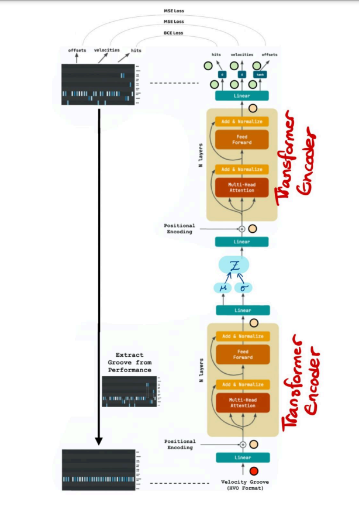

# Chapter 2 - Models:  Instantiating, Storing, Loading, Generating

----

# Table of Contents
1. [Introduction](#1) 
2. [Model Description](#2)
   1. [Network Architecture](#2_i)
   2. [loss functions](#2_ii)
   2. [Training Parameters](#2_ii)


2. [MonotonicGrooveVAE.GrooveTransformerEncoderVAE](#3)
   1. [Instantiation](#3_i)
   2. [Storing](#3_ii)
   3. [Loading](#3_iii)
   4. [Pretrained Versions](#3_iv)
   5. [Generation](#3_v)


## 1. Introduction <a name="1"></a>
The GrooveTransformerEncoderVAE is a real-time drum generator inspired on the "[MonotincGrooveTransformer](../../chapter2_Model/A_MonotonicGrooveTransformer/README.md)" model.
The main difference is the implementation of a variational latent space, which allows a more controlled generation and the capacity to
generate multiple suggestions for a given input.

## 2. Model Description <a name="2"></a>

### 2.i Network Architecture <a name="2_i"></a>

The following figure shows the architecture of the model,  
and how the monotonic groove is transformed into a drum pattern.

Source code available [here](../../../model/Base/BasicGrooveTransformer.py)




### 2.ii loss functions <a name="2_ii"></a>

The loss function is composed of four: the offset loss, velocities loss,
hits loss and the KL divergence loss. 
The reconstruction losses (offset, velocities, hits) are the same as the one used in the [MonotonicGrooveTransformer](../../chapter2_Model/A_MonotonicGrooveTransformer/README.md) model. The KL divergence loss is calculated as follows:


Losses source code available [here](../../../helpers/VAE/train_utils.py)


## 3. `MonotonicGrooveVAE.GrooveTransformerEncoderVAE` <a name="3"></a>
This model use the transformer ${this}_{is}^{inline}$ encoder as both the encoder and the decoder section of a VAE to generate a piano-roll-like drum pattern.


If you use this model, please cite the following ...:
```citation
@article{,
  title={Variational Monotonic Groove Transformer},
  author={Behzad, Hernán, Sergi}
  booktitle={}
  year={}
}
```

### 2.i Instantiation <a name="2_i"></a>
A Variational Monotonic groove transformer consisting of the 
[transformerEncoder](https://pytorch.org/docs/stable/generated/torch.nn.TransformerEncoder.html#torch.nn.TransformerEncoder)
only section of the original transformer, used as the encoder and decoder of a VAE. 

Source code available [here](../../../demos/model/B_VariationalMonotonicGrooveTransformer/GrooveTransformerEncoderVAE_test.py)

```python
params = {
  'd_model_enc': 128,
  'd_model_dec': 512,
  'embedding_size_src': 9,
  'embedding_size_tgt': 27,
  'nhead_enc': 2,
  'nhead_dec': 4,
  'dim_feedforward_enc': 16,
  'dim_feedforward_dec': 32,
  'num_encoder_layers': 3,
  'num_decoder_layers': 5,
  'dropout': 0.1,
  'latent_dim': 32,
  'max_len_enc': 32,
  'max_len_dec': 32,
  'device': 'cpu',
  'o_activation': 'sigmoid',
  'batch_size': 8 }

# test transformer

from model import GrooveTransformerEncoderVAE
device = 'cuda' if torch.cuda.is_available() else 'cpu'
params.update({'device': device})

TM = GrooveTransformerEncoderVAE(params)
```

### 2.ii Storing <a name="2_ii"></a>
The models have a `save` method which can be used to store the model parameters. 
The `save` method takes in a  `**.pth` file path where the model attributes are to be stored. 
The model parameters as well as the model state dictionary are stored in the stored file.

```python
model_path = "model/misc/???/rand_model.pth"
TEM.save(model_path)
```

Using this method, a `**.json` file is also created which stores the model parameters. The data stored in 
this json file is already available in the dictionary stored in the `.pth` file. The json file is created
for conveniently inspecting the model params.

### 2.iii Loading <a name="2_iii"></a>

Source code available [here](../../demos/model/VariationalMonotonicGrooveTransformer/loadVAE_pretrained_versions_available.py)

```python
## 4. Loading a Stored Model <a name="4"></a>

from helpers import load_variational_mgt_model
import torch

# Model path and model_param dictionary
model_name = f"{wandb_project}/{run_name}_{run_id}/{ep_}"
model_path = f"misc/VAE/{model_name}.pth"

# 1. LOAD MODEL
device = 'cuda' if torch.cuda.is_available() else 'cpu'
GrooveTransformer = load_variational_mgt_model(model_path, device=device)

```

### 2.iv Pretrained Versions <a name="3_iv"></a>

The models are:


To load the model, use the `load_variational_mgt_model` 

```python


```
### 2.v Generation <a name="3_v"></a>
Source code available [here](../../demos/model/monotonic_groove_transformer_v1/LoaderSamplerDemo.py)

Create am input groove ([create a HVO_Sequence instance](https://github.com/behzadhaki/GrooveTransformer/blob/main/documentation/chapter1_Data/README.md#create-a-score-),
[load a midi file](https://github.com/behzadhaki/GrooveTransformer/blob/main/documentation/chapter1_Data/README.md#load-from-midi-), 
or [grab one from the HVO_Sequence datasets as below](https://github.com/behzadhaki/GrooveTransformer/blob/main/documentation/chapter1_Data/README.md#load-from-midi-)
```python
from data.dataLoaders import load_gmd_hvo_sequences
test_set = load_gmd_hvo_sequences(
    "data/gmd/resources/storedDicts/groove_2bar-midionly.bz2pickle", "gmd", "data/dataset_json_settings/4_4_Beats_gmd.json", [4],
    "ROLAND_REDUCED_MAPPING", "train")
input_hvo_seq = test_set[np.random.randint(0, len(test_set))]
input_groove_hvo = torch.tensor(input_hvo_seq.flatten_voices(), dtype=torch.float32)
```

Pass groove to model and sample a drum pattern
```python


```


Inspect generations by synthesizing to audio [link to documentation], 
store to midi [link to documentation] , or plot pianorolls [link to documentation]
```python


```
