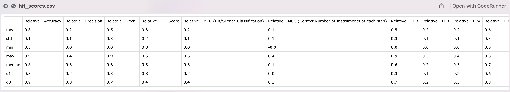
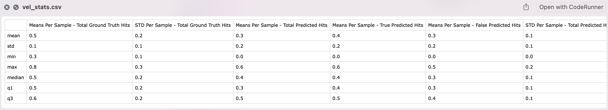
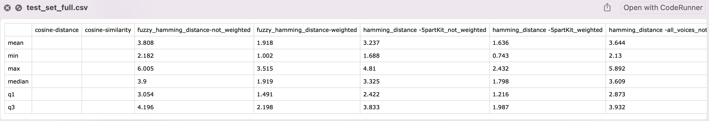
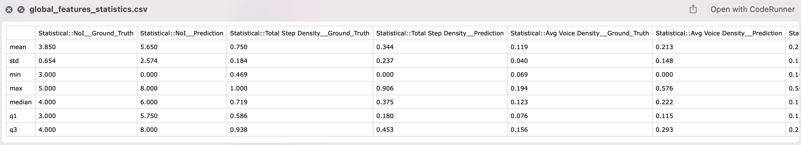

# Chapter 3 - Evaluation Tools (Part B - Accessing Evaluation Results)

-----

# Table of Contents
3. [Accessing Evaluation Results](#3)
   1. [Results as Dictionaries or Pandas.DataFrame](#3_i)
   2. [Rendering Results as Bokeh Plots](#3_ii)
   3. [Rendering Piano Rolls/Audio/Midi](#3_ii)
   

   
## 3. Accessing Evaluation Results <a name="3"></a>

---

The evaluation results can be accesssed in multiple ways. 
The results can be accessed as a dictionary or a Pandas.DataFrame (Section [3.1](#3_i)), 
or they can be rendered as Bokeh plots (Section [3.2](#3_ii)). 
Also, the ground truth samples and the generations can be rendered to piano roll, audio or midi files (Section [3.3](#3_iii)). 

### 3.1. Results as Dictionaries or Pandas.DataFrame <a name="3_i"></a>

The evaluation results can be accessed as a dictionary or a Pandas.DataFrame. 
The following numerical results are automatically computed and compiled into a dictionary or pandas dataframe:


   1. [Quality of Hits](a): Hit counts for gt and pred samples, as well as, cross comparison of hits (accuracy, PPV, ...)
   2. [Quality of Velocities](b): Velocity distributions for gt and pred samples
   3. [Quality of Offsets](c): Offset distributions for gt and pred samples
   4. [Rhythmic Distances](d): Distance of pred samples from gt samples using the rhythm distance metrics implemented in HVO_Sequence (l1, l2, cosine, hamming, ...)
   5. [Global features](e): Global features of the gt and pred samples, these features are the features implemented in HVO_Sequence (NoI, Midness, ...)

These results can be accessed as raw data, that is, per sample values extracted from the evaluation, 
or as aggregated statistics, that is, the mean and standard deviation of the per sample values. 

### Quality of Hits <a name="a"></a>
Use the `get_pos_neg_hit_scores(return_as_pandas_df=False)` method to access the following hit performance scores
for **each of the samples or pairs of gt/pred samples**:


 - 'Relative - Accuracy' : [Accuracy of Hits in Predicted Sample 1 with respect to Ground Truth Sample 1, ...]
 - 'Relative - Precision' 
 - 'Relative - Recall'
 - 'Relative - F1_Score',
 - 'Relative - MCC (Hit/Silence Classification)',
 - 'Relative - MCC (Correct Number of Instruments at each step)',
 - 'Relative - TPR',
 - 'Relative - FPR',
 - 'Relative - PPV',
 - 'Relative - FDR',
 - 'Relative - Ratio of Silences Predicted as Hits',
 - 'Relative - Ratio of Hits Predicted as Silences',
 - 'Hit Count - Ground Truth', [Number of Hits in Ground Truth Sample 1, ...]
 - 'Hit Count - Total Predictions', [Number of Hits in Predicted Sample 1, ...]
 - 'Hit Count - True Predictions (Matching GMD)', [Number of Hits in Predicted Sample 1 that match the ground truth, ...]
 - 'Hit Count - False Predictions (Different from GMD)' [Number of Hits in Predicted Sample 1 that do not match the ground truth, ...]

> **Note** The analysis of hits is done in terms of total counts and also their location of occurrence. 

These features are automatically computed and compiled into a dictionary or pandas dataframe (using the `return_as_pandas_df` argument).

```python
hit_scores = evaluator_test_set.get_pos_neg_hit_scores(return_as_pandas_df=False)
```

Moreover, boxplot statistics (`mean`, `std`, `median`, `q1`, `q3`, `min`, `max`) of the per sample/sample-pair collections can be automatically 
calculated:

```python
hit_scores = statistics_of_hit_scores = evaluator_test_set.get_statistics_of_pos_neg_hit_scores(
hit_weight=1, trim_decimals=1, csv_file="testers/evaluator/misc/hit_scores.csv")
```

The results are available as a pandas dataframe and can be also stored to a csv file if needed

             Relative - Accuracy  ... Hit Count - False Predictions (Different from GMD)
      mean                   0.8  ...                                               44.0
      std                    0.1  ...                                               32.0
      min                    0.5  ...                                                0.0
      max                    0.9  ...                                              130.0
      median                 0.8  ...                                               47.0
      q1                     0.8  ...                                               24.2
      q3                     0.9  ...                                               55.0
      [7 rows x 16 columns]





### Quality of Velocities <a name="b"></a>


Similar to the hit scores, the velocity distributions can be accessed as raw data or as aggregated statistics. 

> **Note** The analysis of velocities is done on the `mean` and `std` of velocity valuaes in each of the samples. 
> To better understand the generations, the velocities are analyzed at (1) all locations (2) locations correpondint to 
> true hits (3) locations corresponding to false hits.

To get the velocity distributions as raw data, use the `get_velocity_distributions(return_as_pandas_df=False)` method:

```python
velocitiy_distributions = evaluator_test_set.get_velocity_distributions(return_as_pandas_df=False)
```

Using this method, the following distributions are extracted:

- 'Means Per Sample - Total Ground Truth Hits',
- 'STD Per Sample - Total Ground Truth Hits',
- 'Means Per Sample - Total Predicted Hits',
- 'Means Per Sample - True Predicted Hits',
- 'Means Per Sample - False Predicted Hits',
- 'STD Per Sample - Total Predicted Hits',
- 'STD Per Sample - True Predicted Hits',
- 'STD Per Sample - False Predicted Hits'

The results are available as a dictionary or pandas dataframe and can be also stored to a csv file if needed:

         Means Per Sample - Total Ground Truth Hits  ...  STD Per Sample - False Predicted Hits
     0                                     0.668933  ...                               0.164607
     1                                     0.732283  ...                               0.133475
     2                                     0.594488  ...                               0.000000


To get the boxplot statistics (`mean`, `std`, `median`, `q1`, `q3`, `min`, `max`):

```python
statistics_of_velocitiy_distributions = evaluator_test_set.get_statistics_of_velocity_distributions(
        trim_decimals=1, csv_file="testers/evaluator/misc/vel_stats.csv")
```




### Quality of Offsets <a name="c"></a>
Similar to the velocity distributions, the offset distributions can be accessed as raw data or as aggregated statistics.

```python
offset_distributions = evaluator_test_set.get_offset_distributions(return_as_pandas_df=False)
statistics_of_offsetocitiy_distributions = evaluator_test_set.get_statistics_of_offset_distributions(
   trim_decimals=1, csv_file="testers/evaluator/misc/offset_stats.csv")
```

### Rhythmic Distances <a name="d"></a>

The rhythmic distances are computed as the distances between the hits in the ground truth and the hits in the predicted sample.
Different distance measures are used for calculating the rhythmic distances:

- '**cosine-distance**': cosine distance between pred and gt using hit, velocity and offsets combined
- '**cosine-similarity**: 1 - cosine_distance
- '**fuzzy_hamming_distance-not_weighted**': fuzzy hamming distance between pred and gt using velocity and offset information
- '**fuzzy_hamming_distance-weighted**': metrically weighted fuzzy hamming distance
- '**hamming_distance -5partKit_not_weighted** ': hamming distance between pred and gt using velocity information only
- '**hamming_distance -5partKit_weighted** ',
- '**hamming_distance -all_voices_not_weighted** ',
- '**hamming_distance -all_voices_weighted** ',
- '**hamming_distance -low_mid_hi_not_weighted** ',
- '**hamming_distance -low_mid_hi_weighted** ',
- '**l1_distance -h**': l1 norm between pred and gt using hit information only 
- '**l1_distance -hvo**': l1 norm between pred and gt using hit, velocity and offset information
- '**l1_distance -o**': l1 norm between pred and gt using offset information only
- '**l1_distance -v**': l1 norm between pred and gt using velocity information only
- '**l2_distance -h**': l2 norm between pred and gt using hit information only
- '**l2_distance -hvo**',
- '**l2_distance -o**',
- '**l2_distance -v**',
- '**structural_similarity-structural_similarity**': 


The distances are available as both raw data or as aggregated statistics.

```python
rhythmic_distances = evaluator_test_set.get_rhythmic_distances_of_pred_to_gt(return_as_pandas_df=False)
rhythmic_distances_statistics_df = evaluator_test_set.get_statistics_of_rhythmic_distances_of_pred_to_gt(
   tag_by_identifier=False, csv_dir="testers/evaluator/misc/distances", trim_decimals=3)
```




### Global features <a name="e"></a>

Global rhythmic features are extracted from both the ground truth and the predicted samples. The following features are extracted:

- 'Statistical::NoI',
- 'Statistical::Total Step Density',
- 'Statistical::Avg Voice Density',
- 'Statistical::Lowness',
- 'Statistical::Midness',
- 'Statistical::Hiness',
- 'Statistical::Vel Similarity Score',
- 'Statistical::Weak to Strong Ratio',
- 'Statistical::Poly Velocity Mean',
- 'Statistical::Poly Velocity std',
- 'Statistical::Poly Offset Mean',
- 'Statistical::Poly Offset std',
- 'Syncopation::Combined',
- 'Syncopation::Polyphonic',
- 'Syncopation::Lowsync',
- 'Syncopation::Midsync',
- 'Syncopation::Hisync',
- 'Syncopation::Lowsyness',
- 'Syncopation::Midsyness',
- 'Syncopation::Hisyness',
- 'Syncopation::Complexity',
- 'Auto-Correlation::Skewness',
- 'Auto-Correlation::Max',
- 'Auto-Correlation::Centroid',
- 'Auto-Correlation::Harmonicity',
- 'Micro-Timing::Swingness',
- 'Micro-Timing::Laidbackness',
- 'Micro-Timing::Accuracy'

The features are available as both raw data or as aggregated statistics:

```python
global_features = evaluator_test_set.get_global_features_values(return_as_pandas_df=False)
get_statistics_of_global_features_df = evaluator_test_set.get_statistics_of_global_features(
  calc_gt=True, calc_pred=True, csv_file="testers/evaluator/misc/global_features_statistics.csv", trim_decimals=3)
```



### 3.2 Rendering Results as Bokeh Plots <a name="3_ii"></a>

The results in section [3.1](#3_i) can also be automatically rendered as Bokeh plots. 
These plots are violin plots, super-imposed with boxplots and the raw scatter data. The plots are separated by Tabs 
for each set of analysis results.

### Quality of Hits <a name="a2"></a>

### Quality of Velocities <a name="b2"></a>

### Quality of Offsets <a name="c2"></a>

### Rhythmic Distances <a name="d2"></a>

### Global features <a name="e2"></a>


### 3.3 Rendering Piano Rolls/Audio/Midi <a name="3_iii"></a>


### Piano Rolls <a name="a3"></a>


### Audio <a name="b3"></a>


### Midi <a name="c3"></a>


