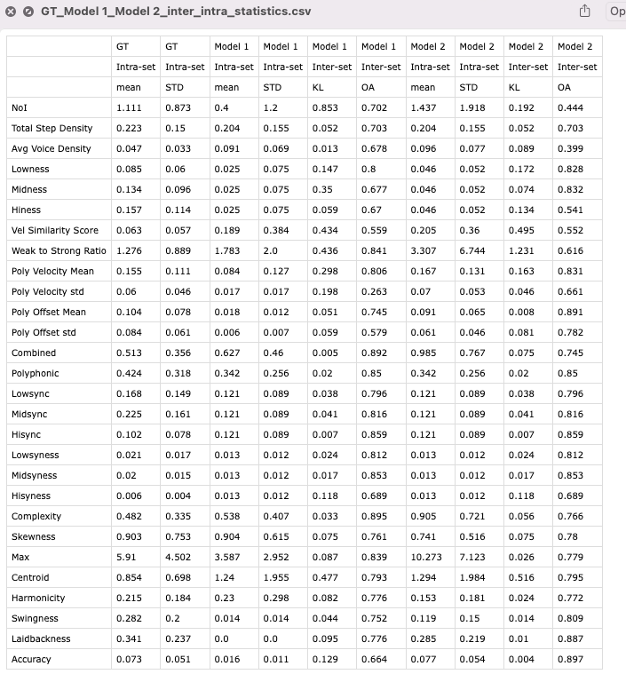
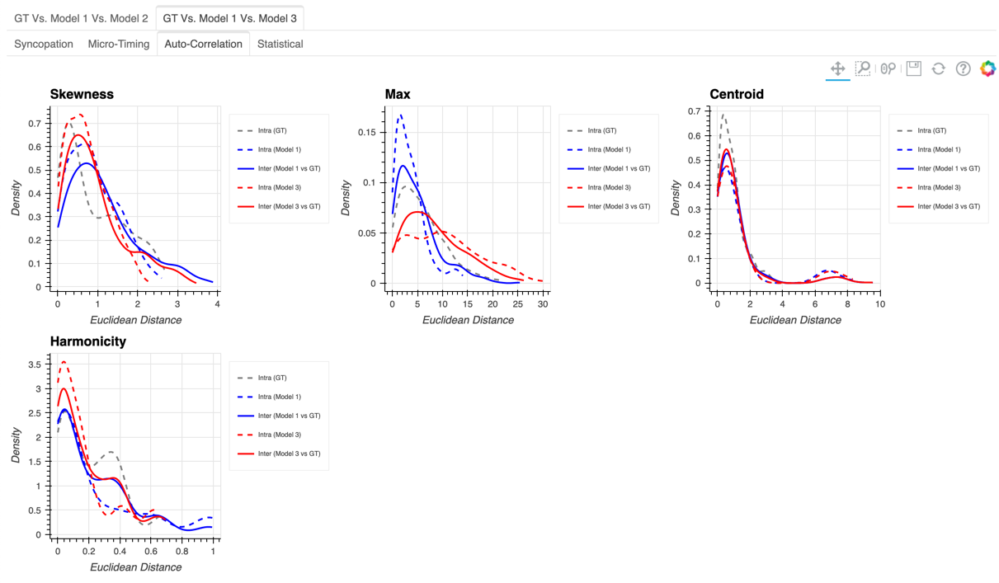
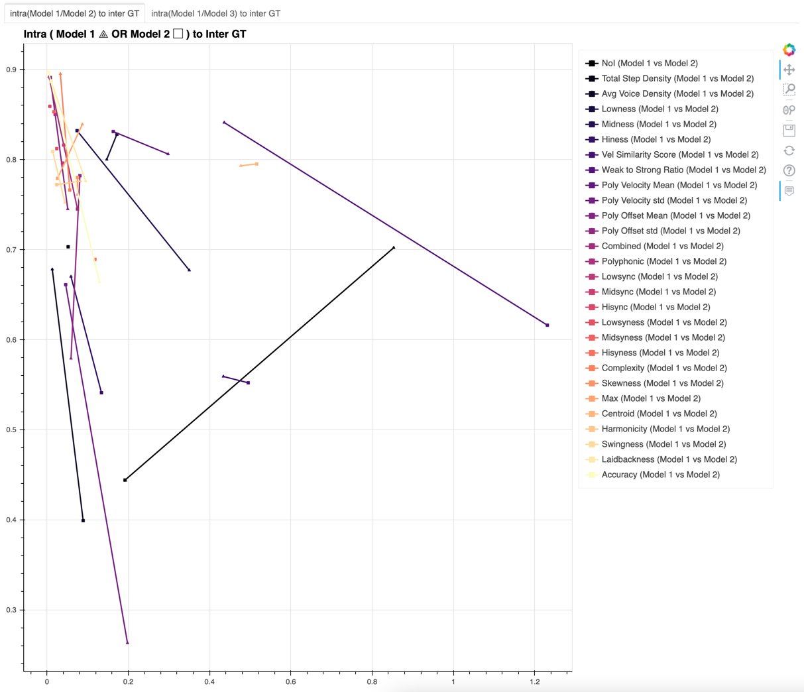
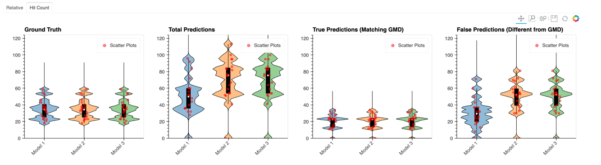
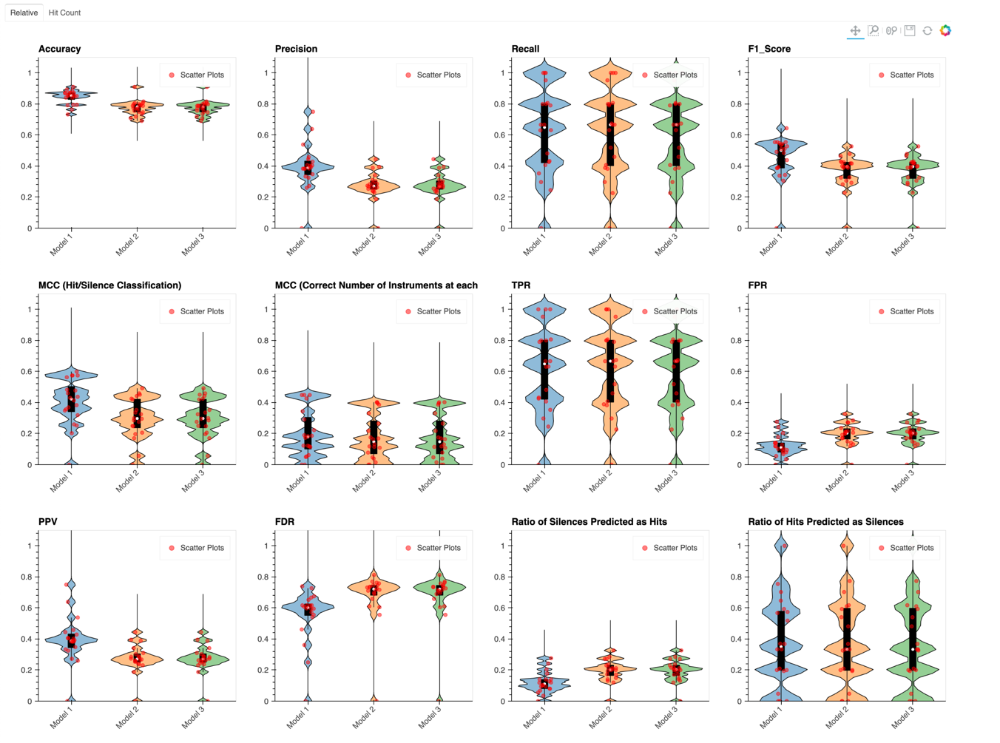
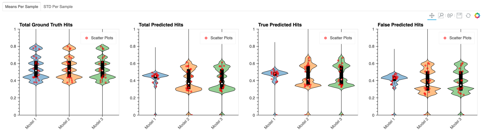
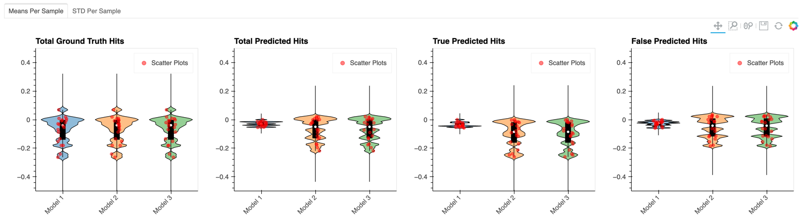
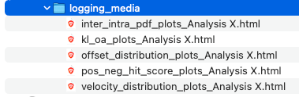

# Chapter 3 - Evaluation Tools
## Part B - MultiSetEvaluator Basics and Usage

-----

# Table of Contents
[MultiSetEvaluator Basics](#2)
1. [Prepapre the sets used for cross comparison](#2_i)
2. [Initialization](#2_ii)
3. [Saving and Loading](#2_iv)
4. [Available Analyzers](#2_v)
   1. [Inter-Intra Analysis (raw statistics, distribution plots and KL/OA Plots)](#2_v_i)
   2. [Hit, Velocity, Offset Analysis](#2_v_ii)
5. [Compiling Results](#2_vi)

-----

# MultiSetEvaluator Basics <a name="2"></a>

The MultiSetEvaluator is a tool that allows you to compare multiple sets of data against each other.
It is useful for comparing the results of different algorithms,
or for comparing the results of the same algorithm with different parameters.
It is also useful for comparing the results of different data sets.

The MultiSetEvaluator is very similar to the [GrooveEvaluator](), with the exception that it can compare multiple sets of data at once.

> **Warning** The MultiSetEvaluator can be computationally expensive, so it is recommended to use it after the training process

> **Note** All codes used in this chapter are available [here](../../testers/MultiSetEvaluator/demo.py)_

## 1. Prepare the sets used for cross comparison <a name="2_i"></a>

The MultiSetEvaluator requires a dictionary containing GrooveEvaluator examples. The keys of the dictionary are the names of the sets, and the values are the GrooveEvaluator examples.

```python
from eval.GrooveEvaluator import load_evaluator
from eval.MultiSetEvaluator import MultiSetEvaluator

# prepare input data
eval_1 = load_evaluator("testers/GrooveEvaluator/examples/test_set_full_robust_sweep_29.Eval.bz2")
eval_2 = load_evaluator("testers/GrooveEvaluator/examples/test_set_full_colorful_sweep_41.Eval.bz2")

groove_evaluator_sets={"Model 1": eval_1, "Model 2": eval_2, "Model 3": eval_2}
```

## 2. Initialization <a name="2_ii"></a>

The MultiSetEvaluator can be initialized by passing the dictionary of GrooveEvaluator examples to the constructor.

```python
msEvaluator = MultiSetEvaluator(
    groove_evaluator_sets={"Model 1": eval_1, "Model 2": eval_2, "Model 3": eval_2}
```

The MultiSetEvaluator can be set-up such that only a subset of HVO_Sequence features are used for the comparison.
This is done by passing a list of HVO_Sequence features to the `ignore_feature_keys` parameter.

Moreover, a number of flags are available to disable certain analysis included in the `default` mode of the MultiSetEvaluator.
This means that, some methods can be used without specifying which analysis to perform, in these cases, the `default` mode is used.

```python
msEvaluator = MultiSetEvaluator(
    groove_evaluator_sets={"Model 1": eval_1, "Model 2": eval_2, "Model 3": eval_2},
    ignore_feature_keys=["Statistical::NoI", "Statistical::Total Step Density"]
    need_pos_neg_hit_score_plots=True,  
    need_velocity_distribution_plots=True,
    need_offset_distribution_plots=True,
    need_inter_intra_pdf_plots=True,
    need_kl_oa_plots=True
)
```

## 3. Saving and Loading <a name="2_iv"></a>

```python
# dump MultiSetEvaluator
msEvaluator.dump("testers/MultiSetEvaluator/misc/inter_intra_evaluator.MSEval.bz2")

# load MultiSetEvaluator
from eval.MultiSetEvaluator import load_multi_set_evaluator
msEvaluator = load_multi_set_evaluator("testers/MultiSetEvaluator/misc/inter_intra_evaluator.MSEval.bz2")
```

## 4. Available Analyzers <a name="2_v"></a>
### 4.1 Accessing Evaluation Results <a name="2_v_i"></a>
#### 4.1.1 Inter-Intra Analysis (raw statistics, distribution plots and KL/OA Plots) <a name="2_v_i"></a>

###### Raw Statistics

```python
# save statistics
msEvaluator.save_statistics_of_inter_intra_distances(dir_path="testers/MultiSetEvaluator/misc/multi_set_evaluator")
```
```pycon
>>> Saved statistics of inter intra distances to:  testers/MultiSetEvaluator/misc/multi_set_evaluator/GT_Model 1_Model 2_inter_intra_statistics.csv
>>> Saved statistics of inter intra distances to:  testers/MultiSetEvaluator/misc/multi_set_evaluator/GT_Model 1_Model 3_inter_intra_statistics.csv
```



###### Distribution Plots

```python
# save inter intra pdf plots
iid_pdfs_bokeh = msEvaluator.get_inter_intra_pdf_plots(
    filename="testers/MultiSetEvaluator/misc/multi_set_evaluator/iid_pdfs.html")
```


###### KL/OA Plots

```python
# save kl oa plots
KL_OA_plot = msEvaluator.get_kl_oa_plots(filename="testers/MultiSetEvaluator/misc/multi_set_evaluator")
```



### 4.2 Hit, Velocity, Offset Analysis <a name="2_v_ii"></a>

###### Hit Score Plots

```python
# get pos neg hit score plots
pos_neg_hit_score_plots = msEvaluator.get_pos_neg_hit_score_plots(
    filename="testers/MultiSetEvaluator/misc/multi_set_evaluator/pos_neg_hit_scores.html")
```





###### Velocity Distribution Plots

```python
# get velocity distribution plots
velocity_distribution_plots = msEvaluator.get_velocity_distribution_plots(
    filename="testers/MultiSetEvaluator/misc/multi_set_evaluator/velocity_distributions.html")
```



###### Offset Distribution Plots

```python
# get offset distribution plots
offset_distribution_plots = msEvaluator.get_offset_distribution_plots(
    filename="testers/MultiSetEvaluator/misc/multi_set_evaluator/offset_distributions.html")
```
)


### 4.3 Compiling Results <a name="2_vi"></a>

###### Compile Bokeh Plots in a Dictionary

```python
# get logging media
logging_media = msEvaluator.get_logging_media(identifier="Analysis X")
```

```pycon
>>> logging_media
>>> {'pos_neg_hit_scores_plots': {'Analysis X': Tabs(id='66207', ...)},
     'offset_distribution_plots': {'Analysis X': Tabs(id='67274', ...)},
     'velocity_distribution_plots': {'Analysis X': Tabs(id='68341', ...)},
     'inter_intra_pdf_plots': {'Analysis X': Tabs(id='76918', ...)},
     'kl_oa_plots': {'Analysis X': Tabs(id='78057', ...)}}
```

###### Compile Some of the Bokeh Plots in a Dictionary

```python
logging_media_partial = msEvaluator.get_logging_media(identifier="Analysis X", need_pos_neg_hit_score_plots=False)
```

```pycon
>>> logging_media_partial
>>> {'offset_distribution_plots': {'Analysis X': Tabs(id='120757', ...)},
    'velocity_distribution_plots': {'Analysis X': Tabs(id='121824', ...)},
    'inter_intra_pdf_plots': {'Analysis X': Tabs(id='130401', ...)},
    'kl_oa_plots': {'Analysis X': Tabs(id='131540', ...)}}
```
###### Compile and Automatically Save Results

```python
logging_media_and_saved = msEvaluator.get_logging_media(
    identifier="Analysis X",
    save_directory="testers/MultiSetEvaluator/misc/logging_media")
```



###### Compile for Logging in WandB and/or Automatically Save Results (with Bokeh Plots)

```python
# get logging media for wandb
logging_media_wandb = msEvaluator.get_logging_media(
    identifier="Analysis X",
    save_directory="testers/MultiSetEvaluator/misc/logging_media",
    prepare_for_wandb=True, need_inter_intra_pdf_plots=False, need_kl_oa_plots=False,
    need_pos_neg_hit_score_plots=True, need_velocity_distribution_plots=True, need_offset_distribution_plots=True)
```
```pycon
>>> logging_media_wandb
>>> {'pos_neg_hit_scores_plots': {'Analysis X': <wandb.sdk.data_types.html.Html at 0x12f4cad90>},
    'offset_distribution_plots': {'Analysis X': <wandb.sdk.data_types.html.Html at 0x133e9dfa0>},
    'velocity_distribution_plots': {'Analysis X': <wandb.sdk.data_types.html.Html at 0x1345db550>},
    'inter_intra_pdf_plots': {'Analysis X': <wandb.sdk.data_types.html.Html at 0x1345508e0>},
    'kl_oa_plots': {'Analysis X': <wandb.sdk.data_types.html.Html at 0x13526a610>}}
```

