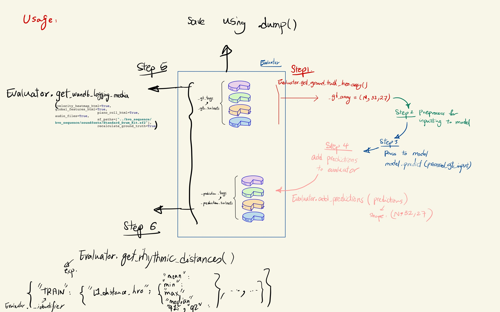

# Chapter 3 - Evaluation Tools

-----

# Table of Contents
1. [Introduction](#1)
2. [GrooveEvaluator Basics](https://github.com/behzadhaki/VariationalMonotonicGrooveTransformer/blob/main/documentation/chapter3_Evaluator/1_basics.md#2-grooveevaluator-basics-)
   1. [Prepapre the data used for Evaluation](https://github.com/behzadhaki/VariationalMonotonicGrooveTransformer/blob/main/documentation/chapter3_Evaluator/1_basics.md#21-prepapre-the-data-used-for-evaluation-)
   2. [Initialization](https://github.com/behzadhaki/VariationalMonotonicGrooveTransformer/blob/main/documentation/chapter3_Evaluator/1_basics.md#22-initialization-)
   3. [Evaluating Predictions](https://github.com/behzadhaki/VariationalMonotonicGrooveTransformer/blob/main/documentation/chapter3_Evaluator/1_basics.md#23-preparing-predictions-)
      1. [Get Ground Truth Samples](https://github.com/behzadhaki/VariationalMonotonicGrooveTransformer/blob/main/documentation/chapter3_Evaluator/1_basics.md#231-get-ground-truth-samples--)
      2. [Pass Samples to Model](https://github.com/behzadhaki/VariationalMonotonicGrooveTransformer/blob/main/documentation/chapter3_Evaluator/1_basics.md#232-pass-samples-to-model-)
      3. [Add Predictions to Evaluator](https://github.com/behzadhaki/VariationalMonotonicGrooveTransformer/blob/main/documentation/chapter3_Evaluator/1_basics.md#233-add-predictions-to-evaluator-)
   4. [Saving and Loading](https://github.com/behzadhaki/VariationalMonotonicGrooveTransformer/blob/main/documentation/chapter3_Evaluator/1_basics.md#24-saving-and-loading-) 
3. [Accessing Evaluation Results](#2_iv_d)
   1. [Results for general inspection](#2_iv_d_i)
   2. [Get Evaluation Results for `WandB`](#2_iv_d_ii)
4. [Ready-to-use Evaluator Templates](#2_v)       # TODO - not implemented yet
   
## 1. Introduction <a name="1"></a>

----

- There are a number of evaluation tools available in the `evaluator` directory. 
   These tools are used to evaluate the performance of the model and better inspect the generated output.
   - Here is a summary of these tools:
     - [GrooveEvaluator](#2): 
       - Allows for automatically extracting the `global features` already implemented in the HVO_Sequence class 
       ([example](https://wandb.ai/mmil_tap2drum/transformer_groove_tap2drum/reports/global_feature_pdfs-Test_Set_Predictions-22-10-14-18-15-10---VmlldzoyNzk2Mzg5)).  
       - Allows for generating `velocity heatmaps` ([example](https://wandb.ai/mmil_tap2drum/transformer_groove_tap2drum/reports/velocity_heatmaps-Test_Set_Predictions-22-10-14-18-16-18---VmlldzoyNzk2Mzkz)).
       - Allows for automatically `synthesizing` generated patterns into audio ([example](https://wandb.ai/mmil_tap2drum/transformer_groove_tap2drum/reports/audios-Validation_Set_Predictions-22-10-14-18-18-30---VmlldzoyNzk2NDAw))
       - Allows for displaying the generations as `piano rolls` ([example](https://wandb.ai/mmil_tap2drum/transformer_groove_tap2drum/reports/piano_roll_html-Validation_Set_Predictions-22-10-14-18-17-13---VmlldzoyNzk2Mzk1)).
       - This tool is designed to smoothly work within the training pipeline (using `W&B`), as well as, outside of the training process.
       - All the analysis done in this section `can be conducted on different subset groups` of the dataset. 
       For example, the dataset can be split into different genres so as to analyze the performance of the model on each genre separately. 

## 2. GrooveEvaluator <a name="2"></a>

---

### 2.1. Prepapre the data used for Evaluation <a name="2i"></a>

First, Load the dataset (read more about loading the dataset [here](https://github.com/behzadhaki/VariationalMonotonicGrooveTransformer/blob/main/documentation/chapter1_Data/README.md#313-load-gmd-dataset-in-hvo_sequence-format-using-a-single-command---))
```python
from data.dataLoaders import load_gmd_hvo_sequences

dataset_setting_json_path = "dataset_setting.json"
test_set = load_gmd_hvo_sequences(
    "data/gmd/resources/storedDicts/groove_2bar-midionly.bz2pickle",
    "gmd", dataset_setting_json_path, "test")
```

Then, if you want to inspect different subsets of the data, specify how the dataset needs to be split into smaller subsets.
```python
list_of_filter_dicts_for_subsets = []
styles = [
    "afrobeat", "afrocuban", "blues", "country", "dance", "funk", "gospel", "highlife", "hiphop", "jazz",
    "latin", "middleeastern", "neworleans", "pop", "punk", "reggae", "rock", "soul"]
for style in styles:
    list_of_filter_dicts_for_subsets.append(
        {"style_primary": [style], "beat_type": ["beat"], "time_signature": ["4-4"]}
    )
```
> **Note**
> In the above case, "beat_type" and "time_signature" are unnecessary as the original dataset (specified in `dataset_setting.json`) 
> is already filtered to only include `beat` and `4-4` patterns. However, if you want to inspect a subset of the dataset that is not  
> filtered in the original dataset, you can specify the filters here. As a result, in this example, it makes more sense to use the following filters
> 

```python
list_of_filter_dicts_for_subsets = []
styles = [
    "afrobeat", "afrocuban", "blues", "country", "dance", "funk", "gospel", "highlife", "hiphop", "jazz",
    "latin", "middleeastern", "neworleans", "pop", "punk", "reggae", "rock", "soul"]
for style in styles:
    list_of_filter_dicts_for_subsets.append(
        {"style_primary": [style]}
    )
```

### 2.2. Initialization <a name="2_ii"></a>

To instantiate the GrooveEvaluator, you need to specify the following parameters:

- **hvo_sequences_list**: A 1D list of HVO_Sequence objects corresponding to ground truth data
- **list_of_filter_dicts_for_subsets**: (Default: None, means use all data without subsetting) The filter dictionaries using which the dataset will be subsetted into different groups. Note that the HVO_Sequence objects must contain `metadata` attributes with the keys specified in the filter dictionaries.
- **_identifier**: A string label to identify the set of HVO_Sequence objects. This is used to name the output files.
- **n_samples_to_use**: (Default: -1, means use all data) The number of samples to use for evaluation in case you don't want to use all the samples. THese are randomly selected.
         (it is recommended to use the entirety of the dataset, if smaller subset is needed, process them externally prior to Evaluator initialization)
- **max_hvo_shape**: (Default: (32, 27)) The maximum shape of the HVO array. This is used to trim/pad the HVO arrays to the same shape.
- **need_heatmap**: (Default: True) Whether to generate velocity timing heatmaps
- **need_global_features**: (Default: True) Whether to generate global features plots
- **need_piano_roll**: (Default: True) Whether to generate piano roll plots
- **need_audio**: (Default: True) Whether to generate audio files
- **n_samples_to_synthesize**: (Default: "all") The number of samples to synthesize audio files for. If "all", all samples will be synthesized.
- **n_samples_to_draw_pianorolls**: (Default: "all") The number of samples to draw piano rolls for. If "all", all samples will be drawn.
- **disable_tqdm**: (Default: False) Whether to disable tqdm progress bars


> **Warning**
> The **_pianoroll and audio sample generations are extremely slow_**. If these are needed during the training process, 
> make sure you only use a small number of samples for generating these. 
> This can be done by manually specifying the n_samples_to_synthesize and n_samples_to_draw_pianorolls parameters. 
> These parameters are **per subset** of the dataset!

> **Recommendation**
> Talk about smaller downsampled datasets for different tasks
> 
> 

### 2.3. Saving and Loading <a name="2_iii"></a>

To save the model, use the `dump` method. You can the `path` parameter to specify the directory in which you want to store the evaluator. Also,
you can use the `fname`, to add aditional information.

```python
evaluator_test_set.dump(path="misc", fname="")

# Output >> Dumped Evaluator to path/test_set_full_fname.Eval.bz2
```

> **Note**
> During training replace `fname` with the epoch number and the training step number to be able to easily identify the evaluator.

To load a saved model, use the full path along with the `load_evaluator` method

```python
from eval.GrooveEvaluator.src.evaluator import load_evaluator
evaluator_test_set = load_evaluator("path/test_set_full_fname.Eval.bz2")
```


### 2.4. Preparing Predictions <a name="2_iv"></a>

Some of the available evaluation methods can be run on the ground truth data. However, most of the methods require 
predictions. As a result, prior to running the evaluation, you need to : 
    (1) prepare the inputs to the model using the [ground truth data](#2_iv_a) available in the evaluator, 
    (2) [pass the inputs to a model](#2_iv_b) and format the results as a **[Batch Size, Time Steps, Num Voices * 3]** numpy array, 
    (3) [pass the formatted results to the evaluator](#2_iv_c) 


Here is a visual guide to using the evaluator for evaluating predictions



#### 2.4.1. Get Ground Truth Samples  <a name="2_iv_a"></a>
Get the ground truth samples as a numpy array displaying piano rolls in HVO format.

```python
evaluator_test_set.get_ground_truth_hvos_array()
```

> **Warning** In groove transformer models, we don't want to feed this tensor to the model. 
> Instead, we want to feed the tapified versions (monotonic groove).
> To do so, we can get the ground truth HVO_Sequence samples and use the internal `flatten_voices` 
> method to get the groove.

```python
import numpy as np
input = np.array([hvo_seq.flatten_voices(voice_idx=2) for hvo_seq in evaluator_test_set.get_ground_truth_hvo_sequences()])
```

#### 2.4.2 Pass Samples to Model <a name="2_iv_b"></a>
```python
predicted_hvos_array = model.predict(input)
```

#### 2.4.3 Add Predictions to Evaluator <a name="2_iv_c"></a>

```python
evaluator_test_set.add_predictions(predicted_hvos_array)
```

#### 2.4.4. Get Evaluation Results <a name="2_iv_d"></a>
The evaluation results can be obtained as a dictionary to be further inspected. Also, they can be obtained as a WANDB ready dictionary to be logged to WANDB.


##### 2.4.4.1 Results for general inspection <a name="2_iv_d_i"></a>
Get the results using the `get_logging_dict` method.

```python
_gt_logging_data, _predicted_logging_data = evaluator_test_set.get_logging_dict()
```

> **Note** Many times during training, you don't need to re-log the ground truth data. 
> In such cases, you can only get the logging dict for the predicted data.
> ```python
>     _predicted_logging_data = evaluator_test_set.get_logging_dict(need_groundTruth=False)
>```


The resulting dictionaries (`_gt_logging_data`, `_predicted_logging_data`) have the following format:

``` python
{
    'velocity_heatmaps': bokeh.models.layouts.Tabs Figure,
     'global_feature_pdfs': bokeh.models.layouts.Tabs Figure, 
     'piano_rolls': bokeh.models.layouts.Tabs Figure,
     'captions_audios': tuple(str, numpy.ndarray), 
}
```

> **Note** The above keys are only available if the `need_heatmap`, `need_global_features`, `need_audio`, 
> `need_piano_roll` parameters are set to True during initialization.

The `velocity_heatmaps`, `global_feature_pdfs`, `piano_rolls` are all tabulated [bokeh](https://docs.bokeh.org/en/latest/#) plots 
and the `captions_audios` are tuples where the first element is the caption and the second element is the audio array.

Here is an example to display the plots or save the audio files
```python
# Show bokeh figures
from bokeh.io import show
show(_predicted_logging_data['velocity_heatmaps'])
show(_predicted_logging_data['global_feature_pdfs'])
show(_predicted_logging_data['piano_rolls'])


# Save audio files
import os
import soundfile as sf
def save_wav_file(filename, data, sample_rate):
    # make directories if filename has directories
    os.makedirs(os.path.dirname(filename), exist_ok=True)
    # save file
    sf.write(filename, data, sample_rate)

sample_audio_tuple = _predicted_logging_data['captions_audios'][0]
fname = sample_audio_tuple[0]
data = sample_audio_tuple[1]
save_wav_file(os.path.join("misc", fname), data, 44100)
```


##### 2.4.4.2 Results for `WandB` <a name="2_iv_d_ii"></a>
Same as above, but the results are in a format that can be directly logged to `WandB` using the `wandb.log` method.

# # TODO: HERE


